# Project for the course Database Managment (Group C)

## Description

This is a project in which the provided data is prepared, a database with them is created and this data is processed to confirm previously developed hypotheses.

## Instruction for start the whole project (just to get the database )

1. Git clone the project via `git clone <link>` command
2. Install [Docker](https://www.docker.com/products/docker-desktop/) on your PC 
3. Make sure that the data in the directory `preparation_module/data/init` is correct (must be csv file with the structure provided from task)
4. Run command `docker compose up -d --build` in your terminal in the root directory of the project 
5. Wait about 5-10 minutes until the preparation's scripts work out
6. Check existence of the data in the database (database is located on `http://localhost:5432`)
7. Manage your database from Docker Desktop or via commands `docker compose up / down`

## Instruction for getting csv files with the data in the directory `preparation_module/data/result`

1. Install Python on your PC (depends on the OS)
2. Run command `pip install -r requirements.txt` from the root directory
3. Change variable `USE_CSV` in the **.env** file from False to **True**
4. Run command from the root directory (or do it via your IDE) `python ./preparation_module/index.py`
5. See result in the mentioned directory

## ERD 

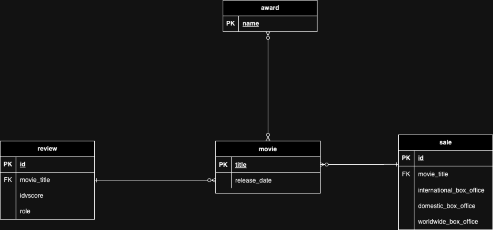

## Folder structure
* `common_module` - the part of project with database connection's configuration
* `preparation_script` - script that prepares the data and insert it to DB (starts as Docker container)
* `result_scripts` - scripts that are used to prove the hypothesis
* `img` contains the images for README
* the root contains additional configuration files

## Results of hypothesis testing
### Movies with higher user review scores will experience higher box office sales.
**To answer the question** “Is there a strong correlation between the grade of user reviews and the movie's box office revenue?” a correlation analysis has been executed.

The table shows a very weak positive correlation between average user review scores and worldwide box office sales. It indicates that as average user review scores increase, there is a slight tendency for worldwide box office sales to increase as well. However the relationship is extremely weak.

**Based on our hypothesis** “movies with higher user review scores will experience higher box office sales” a correlation heatmap has been created. The heatmap shows the correlation of high review scores and low reviews scores on the worldwide, international and domestic box office sales. High user review scores were defined as a score of >= 70, everything below this score is defined as a low user review score.

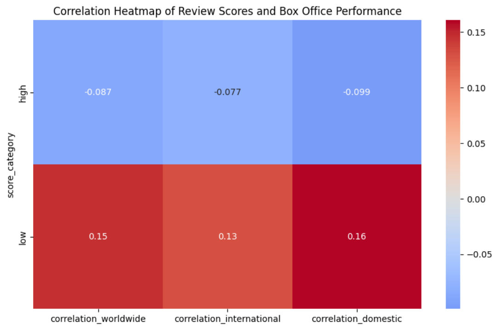

Starting with the correlation with the worldwide box office. For the high review scores there is a weak negative correlation (-0,087) indicating that movies with higher user review scores are slightly more likely to have lower worldwide box office sales. For low user review scores, there is a weak positive correlation of (0,15). Which suggests that movies with lower review scores might have a tendency to perform better worldwide.

The correlation with international box office and domestic box office have a similar outcome. The correlation for high review scores with international box office sales is weakly negative (-0,077), while for low review scores it is weakly positive (0,13). The correlation for high review scores with domestic box office sales is weakly negative (-0,099) , while for low review scores it is weakly positive.

The negative correlations with all forms of box office sales suggest that, based on this dataset, movies with higher review scores do not necessarily achieve higher box office sales. In fact, there is a weak trend indicating that higher review scores may be associated with slightly lower box office sales. On the other hand, the positive correlations, while still weak, suggest a slight trend where movies with lower review scores may experience somewhat higher box office sales. However, these correlations are not strong enough to confidently assert a significant relationship.

**In conclusion** the correlation results do not support the hypothesis “movies with higher user review scores will experience higher box office sales”. Instead they show weak or even slightly negative correlations for high review scores and box office sales.

### Movies with higher reviews scores are likely to have higher box office sales compared to those with lower review scores.
In order to define the impact that the expert reviews have on the box office revenues, a correlation matrix (see next page) was performed.  This demonstrates the correlation between the average expert reviews and the tree box offices: international, domestic and world wide. 

In this method, the average expert reviews are assigned as the independent variable and the box offices are considered the dependent variables. 

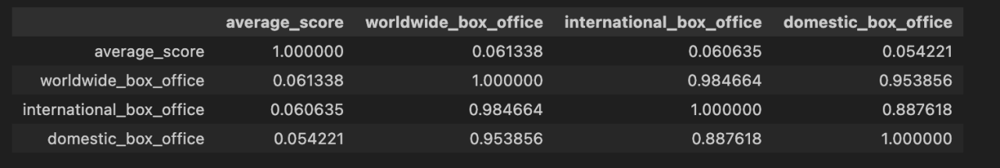

The table above shows that the correlation between the dependent and independent variables is a very weak correlation. To help comprehend this matrix a heat map is chosen to visualize optimistically. This looks as following:

This heatmap shows the correlation between expert review scores and different box office metrics. The correlation with the international box office is (0,061). For the domestic box office the correlation is (0.054) and combined, the worldwide box office has a correlation of (0,061). Together these values are far from being called significant.  It reveals very weak correlations between expert scores and box office performance. However, there is a strong correlation among the various box office metrics themselves. This is expected because the international and domestic box office revenues together make up the total worldwide box office.

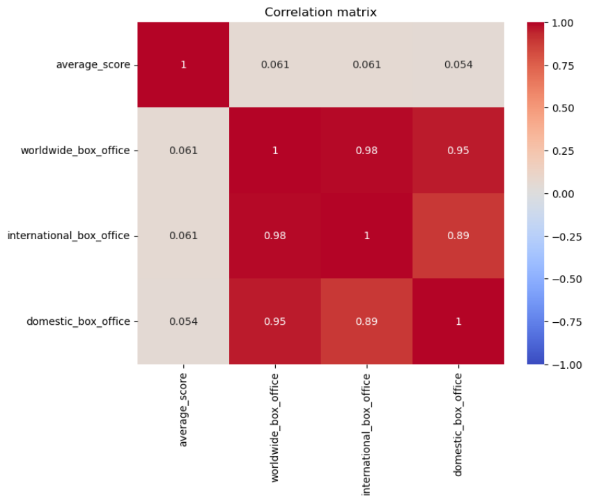

Categorizing the movies based on review scores is necessary to see if there is a clear distinction between low and high scores. By dividing the data into two groups, those with scores below 70 and those with scores of 70 and above, it can better assess the impact of expert reviews on worldwide box office performance. This allows for testing the hypothesis that higher expert scores lead to higher box office outcomes.

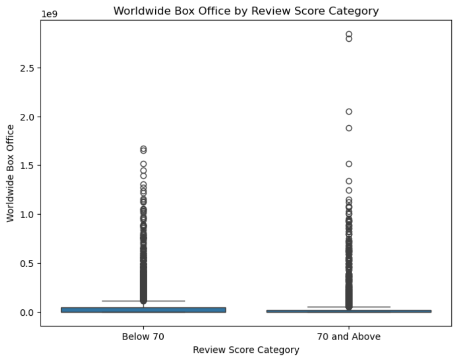

he plot above shows that the distribution of worldwide box office revenue is similar for both categories, with outliers present in both groups. There is no strong indication that movies with higher expert scores consistently generate more revenue compared to those with lower scores.

#### Accepting or rejecting the hypothesis

The hypothesis that goes with the subquestion is as follows: “Movies with higher reviews scores are likely to have higher box office sales compared to those with lower review scores.
Therefore, the hypothesis that movies with expert review scores of 70 and above are more likely to achieve higher box office sales is rejected. While some high-scoring movies do perform well, the overall trend does not show a significant difference between the two groups, suggesting that other factors are more influential in driving box office success.

#### To summarize

The correlation analysis and visualizations show that expert review scores have a very weak relationship with box office performance. The hypothesis that movies with higher review scores are more likely to have higher box office sales is rejected, as no significant difference was observed between the two score categories. 

### Movies that receive much that 70 score reviews from user critics will have a stronger positive impact on box office sales than movies with higher user review scores.
**Accepted:** movies with high user reviews have a slightly larger worldwide box office than movies with high expert reviews.

First of all, in order to confirm the hypothesis and get an answer to the question, it is necessary to obtain data on average builds for films with average reviews above 70 from users and experts, respectively. To access the data more efficiently, VIEWS were created according to the requirements. At the same time, the results were separated, and the films in each of the two VIEWS did not overlap with each other. The query code is provided on the github in the appendix.

The next step was to receive data from the VIEW in the pandas Dataframe, and prepare it. As part of the preparation, two steps were highlighted:

- **min-max normalization** - the process of reducing data to a range from 0 to 1 while maintaining the type of distribution.
- **removing emissions** - deleting data using the k-mean method to clear datasets from invalid data for analysis.
- **bringing two datasets to a single length** - this step is necessary for subsequent statistical tests.

After clearing the data, it is rational to compare the average values of each dataset by calculating the growth parameter from the average of each sample (if it is positive, you can build the H0 hypothesis in such a way that the average collections of films with high user reviews are higher than those of films with high expert reviews).

In our case, the parameter is approximately 0.11, which indicates that the hypothesis is presumably confirmed, but the effect of user reviews is quite slightly superior to the effect of expert reviews.

However, at this stage, it cannot be argued that the results are statistically significant. Two more steps are required to confirm the hypothesis:

- determine the correct statistical test and perform it;
- draw a graph of the density of distributions to visually confirm the hypothesis.

The data from the datasets are paired, as they are collected from a single source. It remains to determine whether the sample distributions are normal and whether the variance of the two datasets is similar. Both statements are hypotheses of H0 when conducting tests.

To determine the normality of the samples, I chose Shapiro-Wilk's W test, since each dataset has up to 5000 elements. The results are presented below, as can be seen, it is not possible to confirm the hypothesis of the normality of distributions. 0.05 was taken as the threshold value for p-value in all tests as an industry standard.

A comparison of the variances showed that the hypothesis of their similarity is confirmed, however, since one of the three conditions is not fulfilled, it is necessary to use a nonparameterized test to confirm the main hypothesis.

According to previously defined criteria, the Wilcoxon signed-rank test was selected to verify the statistical significance of the results of confirming the H0 hypothesis. The results are presented below, as you can see, the data obtained can be considered statistically significant.

n the end, a distribution density diagram was drawn, according to which it can also be seen that the distribution variances are similar, however, the mathematical expectation of box offie sales for sampling films with good user reviews is slightly to the right, which suggests that the effect, although small, is still there.

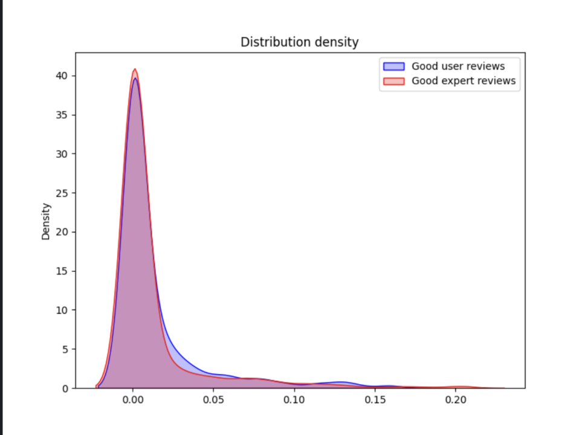

In conclusion, it can be concluded that the hypothesis has been confirmed. Based on this, we can give a preliminary answer to the corresponding sub-question: **user reviews have a slightly greater effect on movie sales at the box office than expert’s reviews.** To clarify the correctness of the conclusions obtained, it is necessary to conduct a study of the opposite hypothesis.

### Movies that win at least one award tend to generate higher worldwide box office revenues than those without awards. 

**Accepted**: Movies with awards make 108% more worldwide box office sales. The timing of a movie's release significantly impacts its box office performance, with higher revenues for movies released during peak seasons compared to off-peak seasons.

First of all, the data is investigated for outliers. There are outliers but the outliers are reasoned. For example, the movie ‘Avatar (2009)’ is the movie with the most worldwide box office sales, this is a valid outlier. 

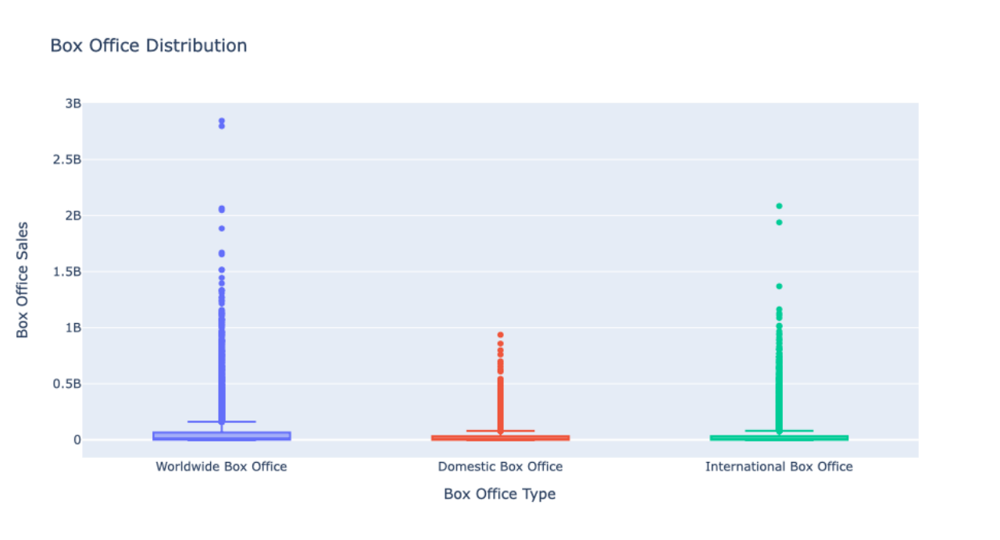

After finding out the outliers, in SQL the averages are discovered. In the plot below is concluded that the average worldwide box office sales with an award, has 108% more sales than movies without an award.

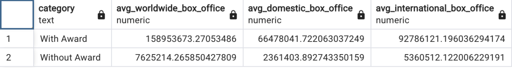

This is the proof that Movies that win at least one award tend to generate higher worldwide box office revenues than those without awards. Concluded is now that an award has influence on the box office sales. But now we can ask, does a ranking of an award match a higher box office sale? The regression analysis concludes that there is no strong relation between the ranking and the box office sales. The reason for this is that the regression analysis only contains ranking data and box office data, for example, no marketing budget etc. The scatter plot concludes that there is a relation between the ranking of an award and the box office sales. 

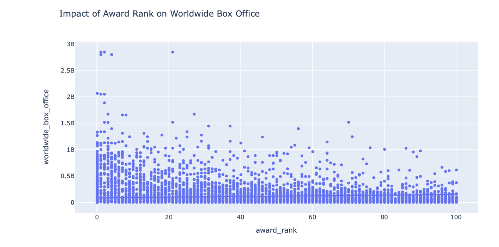

### The timing of a movie´s release significantly impacts its box office , with higher revenues for movies released during peak seasons compared to off/peak seasons.

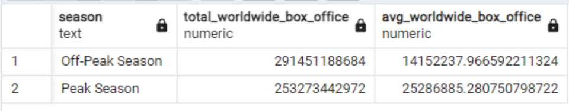

**Off-Peak Season:**
- Total Worldwide Box Office: 291,451,188,684
- Average Worldwide Box Office: 14,152,237.97

**Peak Season:**
- Total Worldwide Box Office: 253,273,442,972
- Average Worldwide Box Office: 25,286,885.28

**Conclusion:**
- **Average Revenue:** Films that debuted during peak seasons tend to generate substantially higher average worldwide earnings (~25.3 million) than those released during off-peak periods (~14.2 million).
- **Overall Revenue:** Although movies released in off-peak seasons had a higher cumulative box office revenue (291 billion vs. 253 billion for peak seasons), this is due to a greater number of films being released during the off-peak times.

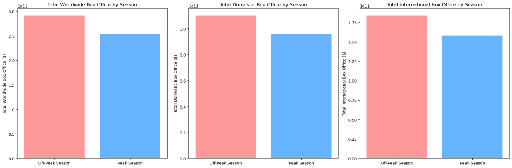

The data supports the idea that movies released during peak seasons typically perform better on a per-film basis. The average box office revenue is noticeably higher for films released in these periods, which aligns with the expectation that peak season releases attract larger audiences. While the average earnings are higher during peak seasons, the total revenue is greater in off-peak seasons. This suggests that off-peak periods see a higher volume of film releases,